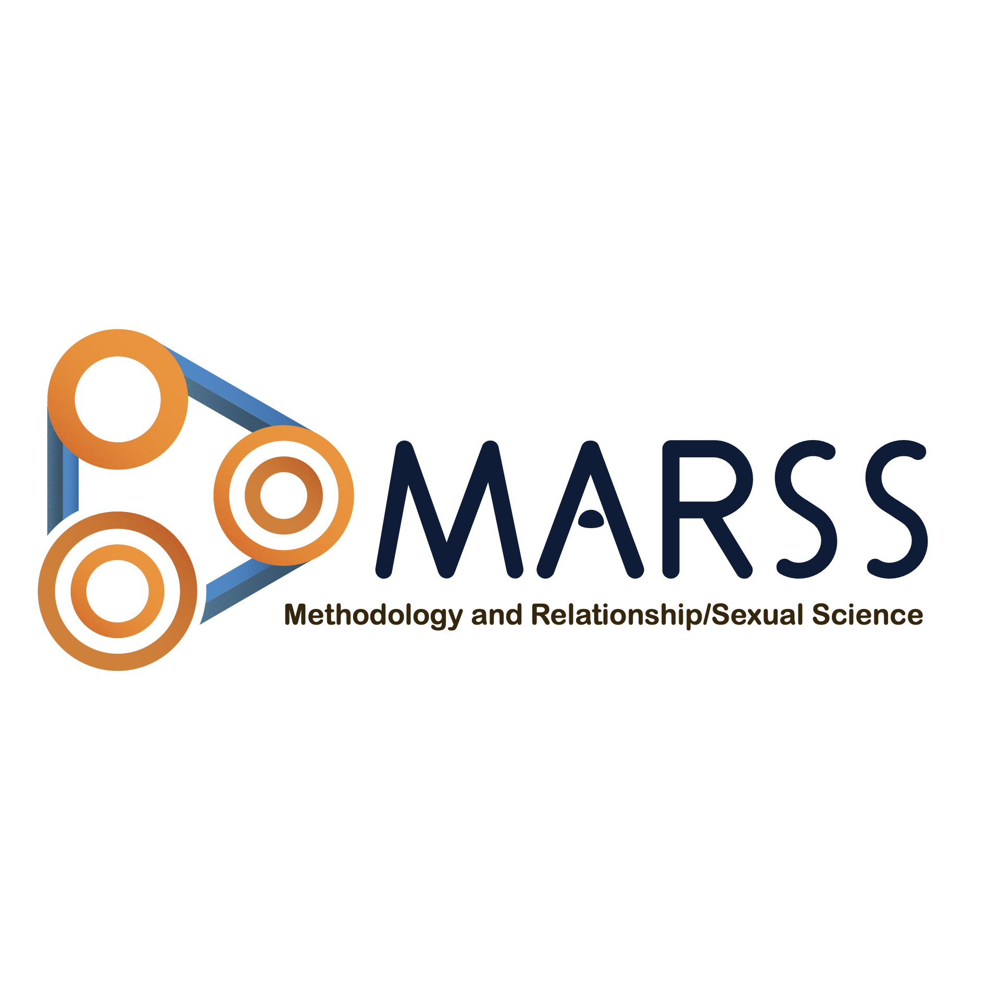
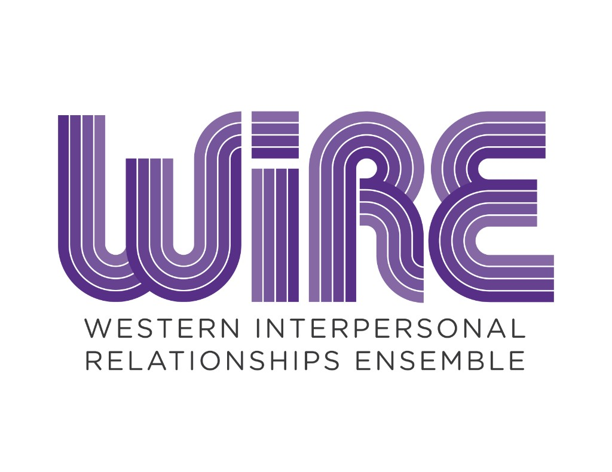

::: {.hero-banner}

{.hero-logo}

::: {.lead}
The **Methodology and Relationship/Sexual Science** lab in the Department of Psychology at Western University advances research at the intersection of quantitative methods and relationship and sexual science.
:::

:::

::: {.home-section}

## What We Do

::: {.what-we-do-grid}

::: {.wwd-card}
::: {.wwd-icon}

:::

#### Quantitative Methods
With few exceptions, our work is quantitative-forward. Whatever the topic, we strive to deploy the most up to date and sophisticated analytic techniques from psychometrics, dyadic data analysis, and/or secondary data analysis. 
:::

::: {.wwd-card}
::: {.wwd-icon}

:::

#### Advanced Psychometrics
Much of our work is psychometric in nature.  When applying psychometric modeling techniques ourselves, we are often interested in using them as a portal for understanding the meaning groups assign to psychological constructs, and how these meanings converge and/or vary across groups. Dr. Sakaluk is increasingly interested in dyadic psychometric modeling, and  applying Monte Carlo methods to evaluate the performance of these models.  
:::

::: {.wwd-card}
::: {.wwd-icon}

:::

#### Contemporary Research Synthesis
We use modern meta-analytic and research synthesis techniques to integrate findings across studies, identify gaps in the literature, and evaluate the robustness of cumulative evidence. Simultaneously, we are also often interested in fusing these analyses with contemporary methods for quantifying the credibility of research evidence, along with descriptive evidence of sampling inclusivity and diversity.
:::

::: {.wwd-card}
::: {.wwd-icon}

:::

#### Open-Source Tools & Open-Access Resources
Throughout much of work, we strive to create free, open-source R packages and open-access tutorials and other resources that make advanced methods accessible to the broader scientific community.
:::

:::

:::

::: {.home-section}

## Part of WIRE

::: {.wire-banner}

[{.wire-logo}](https://wire.uwo.ca)

The MaRSS Lab is a proud member of the **Western Interpersonal Relationships Ensemble (WIRE)** Research Group -- a collaborative network of researchers at Western University who study interpersonal relationships across the lifespan. Our lab activities often overlap with others within the WIRE group, including the labs of Dr. Samantha Joel and Dr. Lorne Campbell, and we are grateful for the support and collaboration we have received from them.

:::

:::

::: {.home-section}

## Lab News

```{r}
#| echo: false
#| results: asis
news <- yaml::read_yaml("news.yml")
n_show <- min(5, length(news))
for (i in seq_len(n_show)) {
  item <- news[[i]]
  cat('<div class="news-item">\n')
  cat(sprintf('<span class="news-date">%s</span>\n\n', item$date))
  cat(sprintf('**%s**\n\n', item$title))
  cat(sprintf('%s\n\n', item$description))
  cat('</div>\n\n')
}
```

:::

::: {.home-section}

## Explore

::: {.grid}

::: {.g-col-12 .g-col-md-4}
[**Meet the Team** →](./people/index.qmd){.btn .btn-primary}

Learn about the people behind the research.
:::

::: {.g-col-12 .g-col-md-4}
[**Our Projects** →](./projects/index.qmd){.btn .btn-primary}

Browse our current and past research projects.
:::

::: {.g-col-12 .g-col-md-4}
[**Read the Blog** →](./blog/index.qmd){.btn .btn-primary}

News, tutorials, and updates from the lab.
:::

:::

:::
