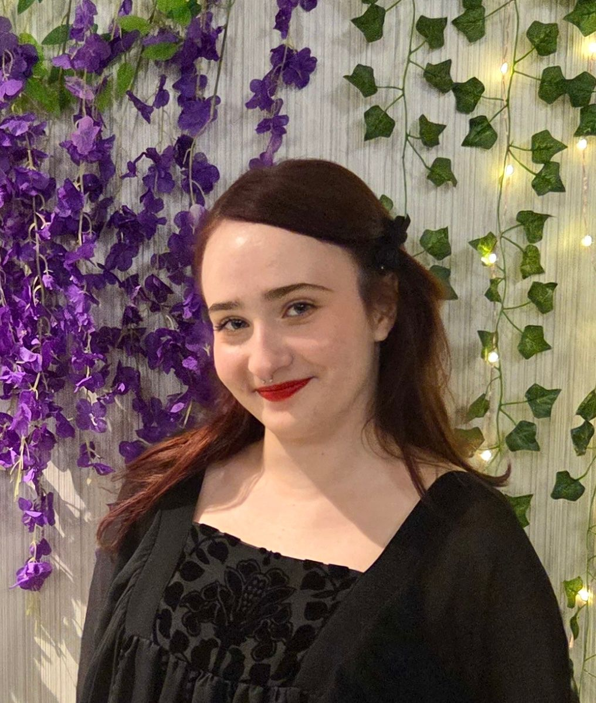

::: {.profile-header}

# Devon Lamplugh {.name}

::: {.subtitle}
Undergraduate Honors Thesis Student | Department of Psychology | Western University
:::

:::

## About

Hi, I’m Devon (she/her)! I’m a fourth-year student in the honours specialization psychology program, and a Brescia University College alumna. My research interests span across biological and social domains, such as women’s health, pleasure, pain, and related stigmas. Outside of school and my job as a barista, I love exploring new music genres, reading Percy Jackson, crocheting, and taking unflattering photos of my chihuahua, Ruby. 

## Research Interests

- Women’s health and sexual dysfunction
- Mental health and medication causing low desire 
- Menstruation, hormones and behaviour
- Feminist, gender and sexuality studies 
- Asexuality, aromanticism, and neurodivergence

## Education

- **B.A.(in progress)** — Western University

## Contact

-  [dlamplug@uwo.ca](mailto:dlamplug@uwo.ca)

