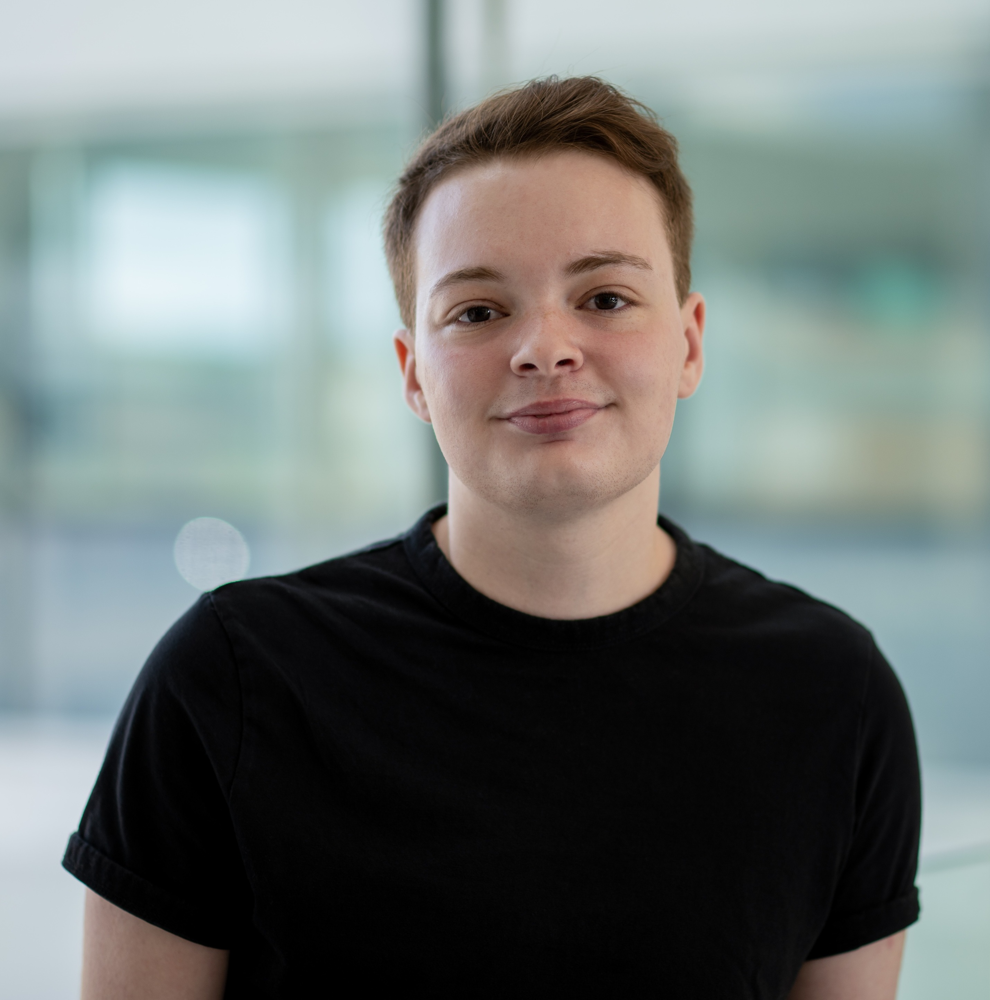

::: {.profile-header}

# Graduate Student Name {.name}

::: {.subtitle}
Ph.D. Student | Department of Psychology | Western University
:::

:::

## About

Hi! I'm Noah (he/him/his) and my research My research interests are in methodology (quantitative and qualitative), statistics (particularly psychometrics), and trans research. I often say I’m interested in any substantive research area insofar as it relates to/can apply to trans people, which casts both a large (but highly population-specific) net.

## Research Interests

- Transgender, non-binary and gender-diverse populations
- Psychometrics

## Education

- **M.Sc. in Experimental Psychology (Health and Wellness).** — Memorial University of Newfoundland
- **B.A.(Hons) in Psychology (minor in Sociology)** — Memorial University of Newfoundland 
- **Certificate in Criminology** — Memorial University of Newfoundland

## Contact

-  [email@uwo.ca](mailto:npevie@uwo.ca)
-  [Google Scholar](https://scholar.google.com/citations?user=86aZ6p4AAAAJ&hl=en&authuser=2)
-  [GitHub](https://github.com/npevie)
