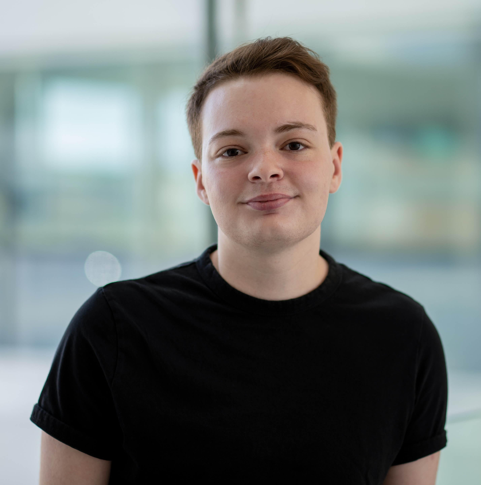

::: {.profile-header}

# Graduate Student Name {.name}

::: {.subtitle}
Ph.D. Candidate | Department of Psychology | Western University
:::

:::

## About

Hi! I'm Noah (he/him/his) and I am a PhD student who joined MaRSS in 2024. My research interests are in transgender and non-binary populations, psychometrics, and advanced statistical methods. I have also developed a passion for qualitative research. I often say I’m interested in any substantive research area insofar as it relates to/can apply to trans and non-binary people, which casts both a large (but highly population-specific) net. When his nose is not in a statistics or trans history book, Noah can be found reading thriller novels, playing Pokémon games, or cuddling his calico cat, Luna. 

## Research Interests

- Transgender, non-binary and gender-diverse populations
- Psychometrics
- Advanced quantitative methods

## Education

- **M.Sc. in Experimental Psychology (Health and Wellness).** — Memorial University of Newfoundland
- **B.A.(Hons) in Psychology (minor in Sociology)** — Memorial University of Newfoundland 
- **Certificate in Criminology** — Memorial University of Newfoundland

## Contact

-  [npevie@uwo.ca](mailto:npevie@uwo.ca)
-  [Google Scholar](https://scholar.google.com/citations?user=86aZ6p4AAAAJ&hl=en&authuser=2)
-  [GitHub](https://github.com/npevie)
