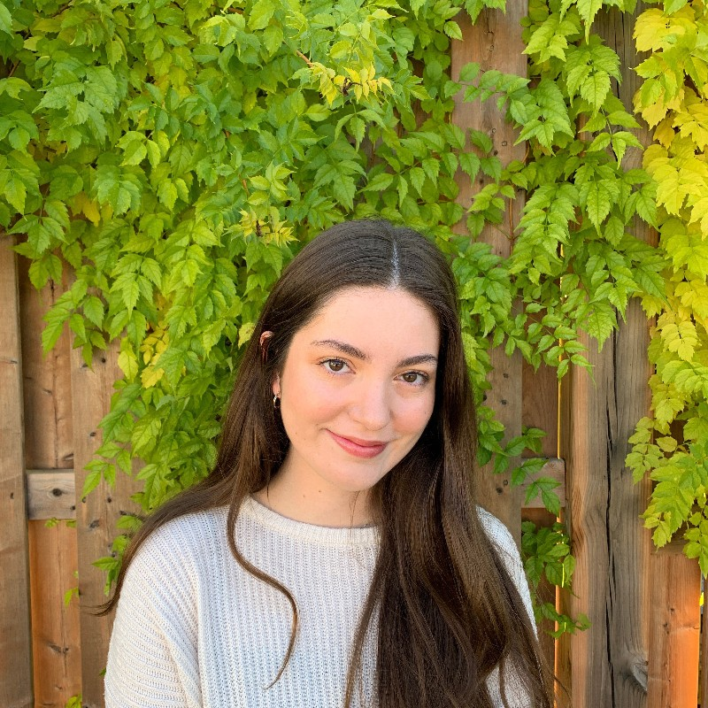

::: {.profile-header}

:::

## About

Former MaRSS Lab honours student. Winner of the 2021 W. J. McLelland Award (Best Honours Thesis) in Psychology. 

## Contact

-  [LinkedIn](https://ca.linkedin.com/in/noemie-bouchard-200732215)

