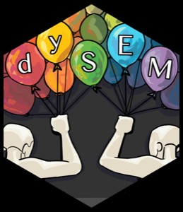

::: {.grid}

::: {.g-col-12 .g-col-md-3}
{width="100%"}
:::

## Overview {.g-col-12 .g-col-md-9}

The `dySEM` package helps automate the process of scripting, fitting, and reporting on latent models of dyadic data via [lavaan](https://lavaan.ugent.be/). It was initially developed in the course of research described in Sakaluk, Fisher, and Kilshaw (2021) and has since undergone considerable expansion.

`dySEM` currently contains **84** functions, of which **31** are user-facing (exported), covered by **551** unit tests.

:::

## Current Functionality

### Uni-Construct Models

- Univariate Dyadic Model
- Correlated Dyadic Factors Model
- Hierarchical Dyadic Factor Model
- Bifactor Dyadic Model

### Bi-Construct Models

- Latent Actor-Partner Interdependence Models (APIM)
- Latent Common Fate Models (CFM)
- Latent Bifactor Dyadic (Bi-Dy) Models
- Observed Actor-Partner Interdependence (APIM)

### Multi-Construct Models

- Multiple Correlated Dyadic Factors Model (Dyadic Confirmatory Factor Analysis)
- Dyadic Exploratory Factor Analysis

### Additional Features

- Automated specification of invariance constraints, including full indistinguishability
- Variable-and-parameter specific tests of noninvariance
- Reproducible path diagrams and tables of statistical output
- Supplemental statistics (omega reliability, noninvariance effect sizes, corrected model fit indexes)
- Multiple open-access datasets for learning and teaching

## Workflow

A typical `dySEM` workflow involves five steps:

1. Import and wrangle **data** into dyad-structure format
2. **Scrape** variables from your data frame
3. **Script** your preferred model
4. **Fit** and **inspect** your model via `lavaan`
5. **Output** statistical visualizations and/or tables

## Installation

Install the released version from CRAN:

```r
install.packages("dySEM")
```

Or the development version from GitHub:

```r
devtools::install_github("jsakaluk/dySEM")
```

## Links

-  [GitHub Repository](https://github.com/jsakaluk/dySEM)
-  [Package Documentation](https://jsakaluk.github.io/dySEM/)
-  [CRAN](https://cran.r-project.org/package=dySEM)

## Media

<!-- Add press releases, news coverage, blog posts, etc. as bullet points: -->
<!-- -  [Article Title](https://link-to-article.com) -->

*No media coverage yet. Add links here as they become available.*
